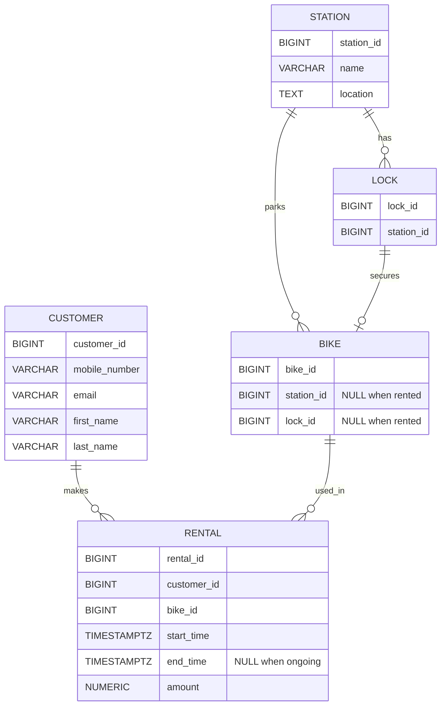

# Besvarelse - Refleksjon og Analyse

**Student:** [Tahmina Nargis Noori]

**Studentnummer:** [tanoo6678]

**Dato:** [Innleveringsdato]

---

## Del 1: Datamodellering

### Oppgave 1.1: Entiteter og attributter

**Identifiserte entiteter:**
**Begrunnelse (kort):**
Systemet består av sykkelstasjoner der sykler kan leies og leveres. Hver sykkel har unik ID og er låst med en lås ved en stasjon. Kunder registrerer seg og kan gjennomføre flere utleier. For hver utleie må starttidspunkt, eventuelt sluttidspunkt og leiebeløp lagres.


- Station (sykkelstasjon)
- Lock (lås)
- Bike (sykkel)
- Customer (kunde)
- Rental (utleie)


**Attributter for hver entitet:**

**Station (sykkelstasjon)**
- station_id
- name
- location

**Lock (lås)**
- lock_id
- station_id

**Bike (sykkel)**
- bike_id
- station_id (NULL når sykkelen er utleid)
- lock_id (NULL når sykkelen er utleid)

**Customer (kunde)**
- customer_id
- mobile_number
- email
- first_name
- last_name

**Rental (utleie)**
- rental_id
- customer_id
- bike_id
- start_time (utlevert)
- end_time (innlevert, NULL til sykkelen leveres)
- amount (leiebeløp)


### Oppgave 1.2: Datatyper og `CHECK`-constraints

**Valgte datatyper og begrunnelser:**

Jeg har valgt datatyper i PostgreSQL som passer til innholdet og gir god dataintegritet:

**Customer (kunde)**
- customer_id: BIGSERIAL – surrogatnøkkel, enkel og effektiv.
- mobile_number: VARCHAR(20) – telefonnummer kan ha landskode (+) og varierer i lengde.
- email: VARCHAR(320) – tilstrekkelig lengde for e-postadresser.
- first_name: VARCHAR(100) – navn er kort tekst.
- last_name: VARCHAR(100) – navn er kort tekst.

**Station (sykkelstasjon)**
- station_id: BIGSERIAL – surrogatnøkkel.
- name: VARCHAR(120) – kort navn.
- location: TEXT – kan være adresse/beskrivelse (ukjent format i case).

**Lock (lås)**
- lock_id: BIGSERIAL – surrogatnøkkel.
- station_id: BIGINT – peker til station.

**Bike (sykkel)**
- bike_id: BIGSERIAL – unik ID per sykkel.
- station_id: BIGINT NULL – NULL når sykkelen er utleid (i følge hint).
- lock_id: BIGINT NULL – NULL når sykkelen er utleid (i følge hint).

**Rental (utleie)**
- rental_id: BIGSERIAL – surrogatnøkkel.
- customer_id: BIGINT – peker til kunde.
- bike_id: BIGINT – peker til sykkel.
- start_time: TIMESTAMPTZ – tidspunkt med tidssone.
- end_time: TIMESTAMPTZ NULL – NULL til sykkelen leveres.
- amount: NUMERIC(10,2) – pengebeløp må lagres nøyaktig.

**`CHECK`-constraints:**

Jeg har lagt til CHECK-constraints der det gir mening for å sikre gyldige verdier:

**Customer**
- mobile_number: bare tall og evt. + i starten, og rimelig lengde  
  CHECK (mobile_number ~ '^\+?[0-9]{8,20}$')

- email: enkel validering av e-postformat  
  CHECK (email ~* '^[A-Z0-9._%+-]+@[A-Z0-9.-]+\.[A-Z]{2,}$')

- first_name / last_name: ikke tom streng  
  CHECK (length(trim(first_name)) > 0)  
  CHECK (length(trim(last_name)) > 0)

**Station**
- name: ikke tom streng  
  CHECK (length(trim(name)) > 0)

**Rental**
- end_time må være NULL (pågående utleie) eller etter/lik start_time  
  CHECK (end_time IS NULL OR end_time >= start_time)

- amount kan ikke være negativt  
  CHECK (amount >= 0)


**ER-diagram:**




### Oppgave 1.3: Primærnøkler

**Valgte primærnøkler og begrunnelser:**

Jeg bruker en primærnøkkel per entitet for å identifisere rader unikt:

- **Station:** station_id som primærnøkkel (surrogatnøkkel).
- **Lock:** lock_id som primærnøkkel (surrogatnøkkel).
- **Bike:** bike_id som primærnøkkel (unik ID per sykkel).
- **Customer:** customer_id som primærnøkkel (surrogatnøkkel).
- **Rental:** rental_id som primærnøkkel (surrogatnøkkel), fordi en kunde kan leie samme sykkel flere ganger og vi trenger en unik identifikator per utleie.


**Naturlige vs. surrogatnøkler:**

Jeg har hovedsakelig valgt **surrogatnøkler** (BIGSERIAL) som primærnøkler fordi de er stabile, korte og effektive, og de endrer seg ikke selv om forretningsdata endres.

Det finnes også **naturlige kandidatnøkler**, spesielt for Customer:
- `email` og/eller `mobile_number` kan ofte være unike.
Jeg bruker dem ikke som primærnøkkel fordi de kan endres (kunden kan bytte e-post/telefonnummer) og fordi format/validering kan variere. Derfor er det bedre å bruke `customer_id` som PK, og heller sette **UNIQUE** på `email` og/eller `mobile_number` senere.


**Oppdatert ER-diagram:**

```mermaid
erDiagram
  STATION {
    BIGINT station_id PK
    VARCHAR name
    TEXT location
  }

  LOCK {
    BIGINT lock_id PK
    BIGINT station_id
  }

  BIKE {
    BIGINT bike_id PK
    BIGINT station_id "NULL when rented"
    BIGINT lock_id "NULL when rented"
  }

  CUSTOMER {
    BIGINT customer_id PK
    VARCHAR mobile_number
    VARCHAR email
    VARCHAR first_name
    VARCHAR last_name
  }

  RENTAL {
    BIGINT rental_id PK
    BIGINT customer_id
    BIGINT bike_id
    TIMESTAMPTZ start_time
    TIMESTAMPTZ end_time "NULL when ongoing"
    NUMERIC amount
  }

  STATION ||--o{ LOCK : has
  STATION ||--o{ BIKE : parks
  LOCK ||--o| BIKE : secures
  CUSTOMER ||--o{ RENTAL : makes
  BIKE ||--o{ RENTAL : used_in
  ```


### Oppgave 1.4: Forhold og fremmednøkler

**Identifiserte forhold og kardinalitet:**

- **Station → Lock:** 1-til-mange  
  En stasjon kan ha mange låser, og hver lås tilhører nøyaktig en stasjon.

- **Station → Bike:** 1-til-mange  
  En stasjon kan ha mange sykler parkert. En sykkel er parkert ved maks en stasjon, men kan også være utleid (da er `station_id` NULL).

- **Lock → Bike:** 1-til-0/1  
  En lås kan være tilknyttet maks en sykkel om gangen. En sykkel som står parkert bruker én lås, men når sykkelen er utleid er `lock_id` NULL.

- **Customer → Rental:** 1-til-mange  
  En kunde kan gjennomføre mange utleier, og hver utleie tilhører én kunde.

- **Bike → Rental:** 1-til-mange  
  En sykkel kan bli leid mange ganger over tid, og hver utleie gjelder én sykkel.


**Fremmednøkler:**

**Fremmednøkler (FK) og hvordan de implementerer forholdene:**

- **LOCK.station_id → STATION.station_id**  
  Implementerer forholdet Station (1) → Lock (mange). Hver lås må høre til en stasjon.

- **BIKE.station_id → STATION.station_id** (kan være NULL)  
  Implementerer forholdet Station (1) → Bike (mange). Når sykkelen er utleid settes `station_id` til NULL.

- **BIKE.lock_id → LOCK.lock_id** (kan være NULL)  
  Implementerer forholdet Lock (1) → Bike (0/1). Når sykkelen er utleid settes `lock_id` til NULL.

- **RENTAL.customer_id → CUSTOMER.customer_id**  
  Implementerer forholdet Customer (1) → Rental (mange). Hver utleie tilhører en kunde.

- **RENTAL.bike_id → BIKE.bike_id**  
  Implementerer forholdet Bike (1) → Rental (mange). Hver utleie gjelder en bestemt sykkel.

**Oppdatert ER-diagram:**
 
 ```mermaid

 erDiagram
  STATION {
    BIGINT station_id PK
    VARCHAR name
    TEXT location
  }

  LOCK {
    BIGINT lock_id PK
    BIGINT station_id FK
  }

  BIKE {
    BIGINT bike_id PK
    BIGINT station_id FK "NULL when rented"
    BIGINT lock_id FK "NULL when rented"
  }

  CUSTOMER {
    BIGINT customer_id PK
    VARCHAR mobile_number
    VARCHAR email
    VARCHAR first_name
    VARCHAR last_name
  }

  RENTAL {
    BIGINT rental_id PK
    BIGINT customer_id FK
    BIGINT bike_id FK
    TIMESTAMPTZ start_time
    TIMESTAMPTZ end_time "NULL when ongoing"
    NUMERIC amount
  }

  STATION ||--o{ LOCK : has
  STATION ||--o{ BIKE : parks
  LOCK ||--o| BIKE : secures
  CUSTOMER ||--o{ RENTAL : makes
  BIKE ||--o{ RENTAL : used_in
  ```


### Oppgave 1.5: Normalisering

**Vurdering av 1. normalform (1NF):**

Datamodellen tilfredsstiller 1NF fordi alle tabeller har atomiske attributter (en verdi per felt), og det finnes ingen repeterende grupper eller lister i en kolonne. For eksempel lagres e-post og mobilnummer som egne felt, og en utleie (Rental) er en rad per utleiehendelse.


**Vurdering av 2. normalform (2NF):**

Datamodellen tilfredsstiller 2NF fordi alle tabeller bruker enkolonne-primærnøkler (surrogatnøkler), og dermed kan ingen ikke-nøkkelattributter være delvis avhengige av en sammensatt nøkkel. Alle ikke-nøkkelattributter i hver tabell avhenger av hele primærnøkkelen (f.eks. i RENTAL avhenger start_time, end_time og amount av rental_id).


**Vurdering av 3. normalform (3NF):**

Datamodellen tilfredsstiller 3NF fordi alle ikke-nøkkelattributter avhenger direkte av primærnøkkelen, og det finnes ingen transitive avhengigheter (ikke-nøkkel → ikke-nøkkel) innenfor samme tabell. 
For eksempel ligger kundeinformasjon (navn, e-post, mobil) kun i CUSTOMER-tabellen og ikke i RENTAL, og stasjonsinformasjon ligger kun i STATION og ikke i BIKE/LOCK. Dermed unngås redundans og oppdateringsanomalier.


**Eventuelle justeringer:**
 Modellen var allerede på 3NF basert på valgte entiteter og attributter, så det var ikke nødvendig med større justeringer. Eventuelle unike forretningsregler (som unikhet på e-post/mobil) kan håndteres med UNIQUE-constraints, men påvirker ikke normalformene.

---

## Del 2: Database-implementering

### Oppgave 2.1: SQL-skript for database-initialisering

**Plassering av SQL-skript:**

SQL-skriptet er lagt i init-scripts/01-init-database.sql.


**Antall testdata:**

- Kunder: [3]
- Sykler: [5]
- Sykkelstasjoner: [3]
- Låser (bike_lock): [7]
- Utleier: [2]

---

### Oppgave 2.2: Kjøre initialiseringsskriptet

**Dokumentasjon av vellykket kjøring:**

Jeg kjørte `docker compose up -d --build` uten feil, og databasen startet.

Jeg verifiserte at containeren kjører med `docker ps`:

[ [+] up 1/1
✔ Container data1500-postgres Created
CONTAINER ID   IMAGE               COMMAND                  CREATED          STATUS                    PORTS                     NAMES
9f1e3f892c7d   postgres:15-alpine   "docker-entrypoint.s…"   32 seconds ago   Up 32 seconds (healthy)   0.0.0.0:5432->5432/tcp    data1500-postgres]


**Spørring mot systemkatalogen:**

```sql
SELECT table_name 
FROM information_schema.tables 
WHERE table_schema = 'public' 
  AND table_type = 'BASE TABLE'
ORDER BY table_name;
```

**Resultat:**

```
bike
bike_lock
customer
rental
station

```

---

## Del 3: Tilgangskontroll

### Oppgave 3.1: Roller og brukere

**SQL for å opprette rolle:**

```sql
[Skriv din SQL-kode for å opprette rollen 'kunde' her]
```

**SQL for å opprette bruker:**

```sql
[Skriv din SQL-kode for å opprette brukeren 'kunde_1' her]
```

**SQL for å tildele rettigheter:**

```sql
[Skriv din SQL-kode for å tildele rettigheter til rollen her]
```

---

### Oppgave 3.2: Begrenset visning for kunder

**SQL for VIEW:**

```sql
[Skriv din SQL-kode for VIEW her]
```

**Ulempe med VIEW vs. POLICIES:**

[Skriv ditt svar her - diskuter minst én ulempe med å bruke VIEW for autorisasjon sammenlignet med POLICIES]

---

## Del 4: Analyse og Refleksjon

### Oppgave 4.1: Lagringskapasitet

**Gitte tall for utleierate:**

- Høysesong (mai-september): 20000 utleier/måned
- Mellomsesong (mars, april, oktober, november): 5000 utleier/måned
- Lavsesong (desember-februar): 500 utleier/måned

**Totalt antall utleier per år:**

[Skriv din utregning her]

**Estimat for lagringskapasitet:**

[Skriv din utregning her - vis hvordan du har beregnet lagringskapasiteten for hver tabell]

**Totalt for første år:**

[Skriv ditt estimat her]

---

### Oppgave 4.2: Flat fil vs. relasjonsdatabase

**Analyse av CSV-filen (`data/utleier.csv`):**

**Problem 1: Redundans**

[Skriv ditt svar her - gi konkrete eksempler fra CSV-filen som viser redundans]

**Problem 2: Inkonsistens**

[Skriv ditt svar her - forklar hvordan redundans kan føre til inkonsistens med eksempler]

**Problem 3: Oppdateringsanomalier**

[Skriv ditt svar her - diskuter slette-, innsettings- og oppdateringsanomalier]

**Fordeler med en indeks:**

[Skriv ditt svar her - forklar hvorfor en indeks ville gjort spørringen mer effektiv]

**Case 1: Indeks passer i RAM**

[Skriv ditt svar her - forklar hvordan indeksen fungerer når den passer i minnet]

**Case 2: Indeks passer ikke i RAM**

[Skriv ditt svar her - forklar hvordan flettesortering kan brukes]

**Datastrukturer i DBMS:**

[Skriv ditt svar her - diskuter B+-tre og hash-indekser]

---

### Oppgave 4.3: Datastrukturer for logging

**Foreslått datastruktur:**

[Skriv ditt svar her - f.eks. heap-fil, LSM-tree, eller annen egnet datastruktur]

**Begrunnelse:**

**Skrive-operasjoner:**

[Skriv ditt svar her - forklar hvorfor datastrukturen er egnet for mange skrive-operasjoner]

**Lese-operasjoner:**

[Skriv ditt svar her - forklar hvordan datastrukturen håndterer sjeldne lese-operasjoner]

---

### Oppgave 4.4: Validering i flerlags-systemer

**Hvor bør validering gjøres:**

[Skriv ditt svar her - argumenter for validering i ett eller flere lag]

**Validering i nettleseren:**

[Skriv ditt svar her - diskuter fordeler og ulemper]

**Validering i applikasjonslaget:**

[Skriv ditt svar her - diskuter fordeler og ulemper]

**Validering i databasen:**

[Skriv ditt svar her - diskuter fordeler og ulemper]

**Konklusjon:**

[Skriv ditt svar her - oppsummer hvor validering bør gjøres og hvorfor]

---

### Oppgave 4.5: Refleksjon over læringsutbytte

**Hva har du lært så langt i emnet:**

[Skriv din refleksjon her - diskuter sentrale konsepter du har lært]

**Hvordan har denne oppgaven bidratt til å oppnå læringsmålene:**

[Skriv din refleksjon her - koble oppgaven til læringsmålene i emnet]

Se oversikt over læringsmålene i en PDF-fil i Canvas https://oslomet.instructure.com/courses/33293/files/folder/Plan%20v%C3%A5ren%202026?preview=4370886

**Hva var mest utfordrende:**

[Skriv din refleksjon her - diskuter hvilke deler av oppgaven som var mest krevende]

**Hva har du lært om databasedesign:**

[Skriv din refleksjon her - reflekter over prosessen med å designe en database fra bunnen av]

---

## Del 5: SQL-spørringer og Automatisk Testing

**Plassering av SQL-spørringer:**

[Bekreft at du har lagt SQL-spørringene i `test-scripts/queries.sql`]


**Eventuelle feil og rettelser:**

[Skriv ditt svar her - hvis noen tester feilet, forklar hva som var feil og hvordan du rettet det]

---

## Del 6: Bonusoppgaver (Valgfri)

### Oppgave 6.1: Trigger for lagerbeholdning

**SQL for trigger:**

```sql
[Skriv din SQL-kode for trigger her, hvis du har løst denne oppgaven]
```

**Forklaring:**

[Skriv ditt svar her - forklar hvordan triggeren fungerer]

**Testing:**

[Skriv ditt svar her - vis hvordan du har testet at triggeren fungerer som forventet]

---

### Oppgave 6.2: Presentasjon

**Lenke til presentasjon:**

[Legg inn lenke til video eller presentasjonsfiler her, hvis du har løst denne oppgaven]

**Hovedpunkter i presentasjonen:**

[Skriv ditt svar her - oppsummer de viktigste punktene du dekket i presentasjonen]

---

**Slutt på besvarelse**
